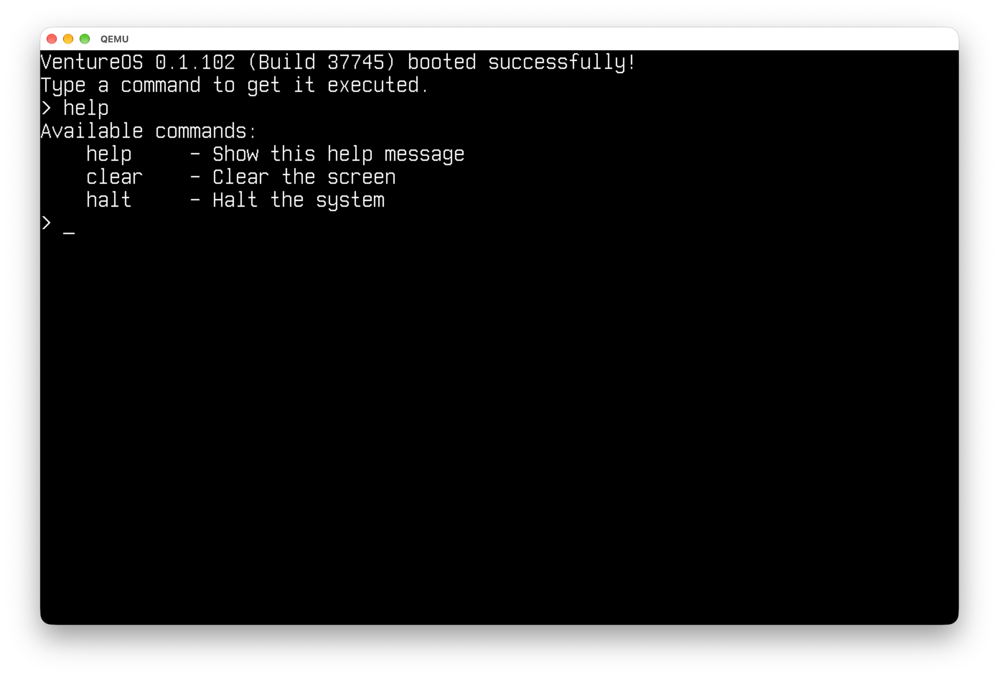

# VentureOS

<p style="text-align: center;">

  <br>
  <a href="https://github.com/tonytins/Venture/blob/main/LICENSE"></a>
  <a href="https://github.com/tonytins/Venture/actions?query=workflow%3Acosmos.yml"></a>
  
</p>

Named after the Siemens' [passenger cars](https://en.wikipedia.org/wiki/Siemens_Venture), VentureOS is my hobby operating
system written in C# and based on the [Cosmos](https://github.com/CosmosOS/Cosmos) framework. It is the spiritual successor to my earlier project, [TOMAS](https://github.com/tonytins/tomas/).

## 🚀Getting Started

See the Cosmos [installation guide](https://cosmosos.github.io/articles/user/install.html).

### Prerequisites

- [.NET 10 SDK](https://dotnet.microsoft.com/download) or later
- [Visual Studio Code](https://code.visualstudio.com/)
- [Homebrew](https://brew.sh/) on macOS

#### Windows

Go to the [Releases](https://github.com/CosmosOS/Cosmos/releases) page on Cosmos' Github and download:

```
CosmosSetup-<version>-windows.exe
```

#### macOS/Linux

```
dotnet tool install -g Cosmos.Tools
cosmos install
```

### Building

```
cosmos build
cosmos run
```

## ⚖️ No Copyright

Copyrights and any related rights for VentureOS are waived via the [UNLICENSE](UNLICENSE). Credit still appreciated.
